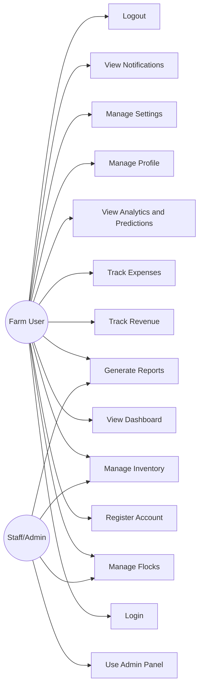
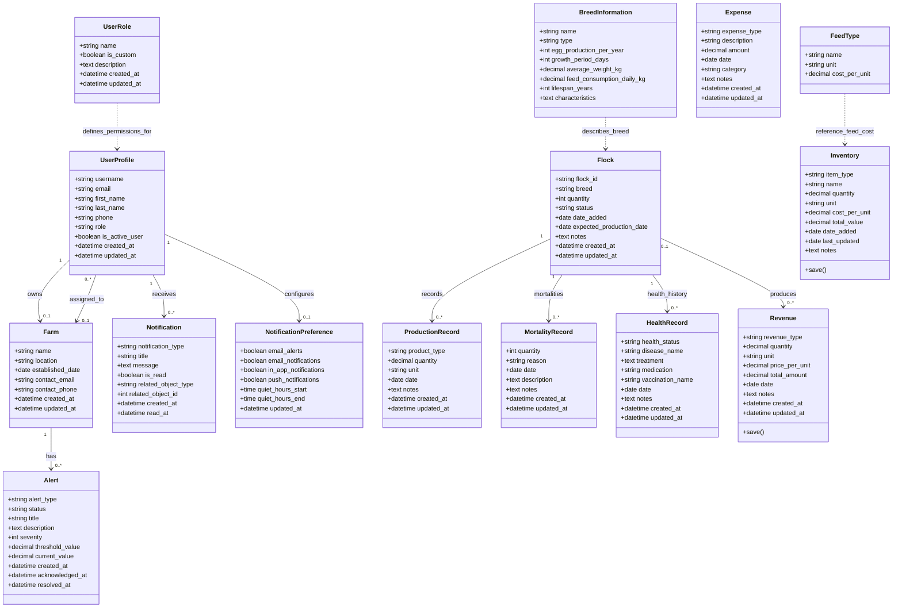
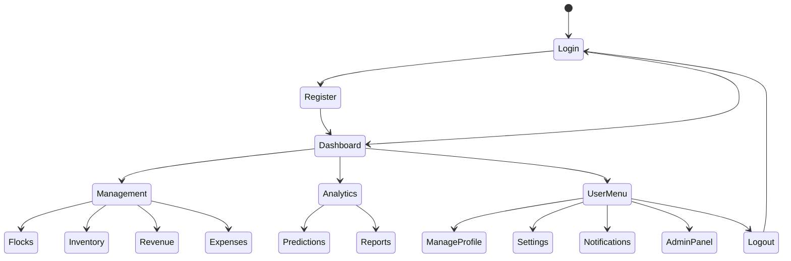

# SMARTPOULTRY UML Diagrams

## Use Case Diagram

```mermaid
flowchart LR
    User((Farm User))
    Staff((Staff/Admin))

    Login[Login]
    Register[Register Account]
    Dashboard[View Dashboard]
    Flocks[Manage Flocks]
    Inventory[Manage Inventory]
    Revenue[Track Revenue]
    Expenses[Track Expenses]
    Analytics[View Analytics and Predictions]
    Reports[Generate Reports]
    Profile[Manage Profile]
    Settings[Manage Settings]
    Notifications[View Notifications]
    Admin[Use Admin Panel]
    Logout[Logout]

    User --> Login
    User --> Register
    User --> Dashboard
    User --> Flocks
    User --> Inventory
    User --> Revenue
    User --> Expenses
    User --> Analytics
    User --> Reports
    User --> Profile
    User --> Settings
    User --> Notifications
    User --> Logout

    Staff --> Admin
    Staff --> Flocks
    Staff --> Inventory
    Staff --> Reports
```

## Class Diagram

```mermaid
classDiagram
    class UserProfile {
        +string username
        +string email
        +string first_name
        +string last_name
        +string phone
        +string role
        +boolean is_active_user
        +datetime created_at
        +datetime updated_at
    }

    class UserRole {
        +string name
        +boolean is_custom
        +text description
        +datetime created_at
        +datetime updated_at
    }

    class Farm {
        +string name
        +string location
        +date established_date
        +string contact_email
        +string contact_phone
        +datetime created_at
        +datetime updated_at
    }

    class Flock {
        +string flock_id
        +string breed
        +int quantity
        +string status
        +date date_added
        +date expected_production_date
        +text notes
        +datetime created_at
        +datetime updated_at
    }

    class FeedType {
        +string name
        +string unit
        +decimal cost_per_unit
    }

    class Inventory {
        +string item_type
        +string name
        +decimal quantity
        +string unit
        +decimal cost_per_unit
        +decimal total_value
        +date date_added
        +date last_updated
        +text notes
        +save()
    }

    class Revenue {
        +string revenue_type
        +decimal quantity
        +string unit
        +decimal price_per_unit
        +decimal total_amount
        +date date
        +text notes
        +datetime created_at
        +datetime updated_at
        +save()
    }

    class Expense {
        +string expense_type
        +string description
        +decimal amount
        +date date
        +string category
        +text notes
        +datetime created_at
        +datetime updated_at
    }

    class ProductionRecord {
        +string product_type
        +decimal quantity
        +string unit
        +date date
        +text notes
        +datetime created_at
        +datetime updated_at
    }

    class MortalityRecord {
        +int quantity
        +string reason
        +date date
        +text description
        +text notes
        +datetime created_at
        +datetime updated_at
    }

    class HealthRecord {
        +string health_status
        +string disease_name
        +text treatment
        +string medication
        +string vaccination_name
        +date date
        +text notes
        +datetime created_at
        +datetime updated_at
    }

    class BreedInformation {
        +string name
        +string type
        +int egg_production_per_year
        +int growth_period_days
        +decimal average_weight_kg
        +decimal feed_consumption_daily_kg
        +int lifespan_years
        +text characteristics
    }

    class Notification {
        +string notification_type
        +string title
        +text message
        +boolean is_read
        +string related_object_type
        +int related_object_id
        +datetime created_at
        +datetime read_at
    }

    class Alert {
        +string alert_type
        +string status
        +string title
        +text description
        +int severity
        +decimal threshold_value
        +decimal current_value
        +datetime created_at
        +datetime acknowledged_at
        +datetime resolved_at
    }

    class NotificationPreference {
        +boolean email_alerts
        +boolean email_notifications
        +boolean in_app_notifications
        +boolean push_notifications
        +time quiet_hours_start
        +time quiet_hours_end
        +datetime updated_at
    }

    UserProfile "1" --> "0..1" Farm : owns
    UserProfile "0..*" --> "0..1" Farm : assigned_to
    UserProfile "1" --> "0..*" Notification : receives
    UserProfile "1" --> "0..1" NotificationPreference : configures

    Farm "1" --> "0..*" Alert : has

    Flock "1" --> "0..*" ProductionRecord : records
    Flock "1" --> "0..*" MortalityRecord : mortalities
    Flock "1" --> "0..*" HealthRecord : health_history
    Flock "0..1" --> "0..*" Revenue : produces

    UserRole ..> UserProfile : defines_permissions_for
    BreedInformation ..> Flock : describes_breed
    FeedType ..> Inventory : reference_feed_cost
```

## Main Navigation Structure

```mermaid
stateDiagram-v2
    [*] --> Login
    Login --> Register
    Register --> Dashboard
    Login --> Dashboard

    Dashboard --> Management
    Dashboard --> Analytics
    Dashboard --> UserMenu

    Management --> Flocks
    Management --> Inventory
    Management --> Revenue
    Management --> Expenses

    Analytics --> Predictions
    Analytics --> Reports

    UserMenu --> ManageProfile
    UserMenu --> Settings
    UserMenu --> Notifications
    UserMenu --> AdminPanel
    UserMenu --> Logout

    Logout --> Login
```

