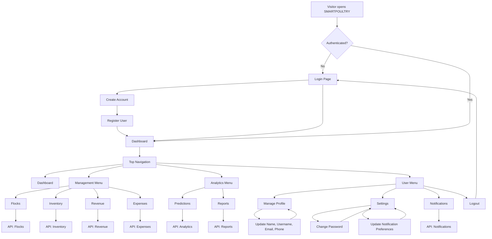
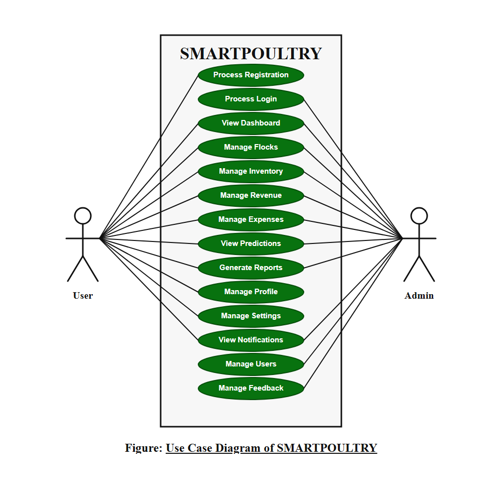
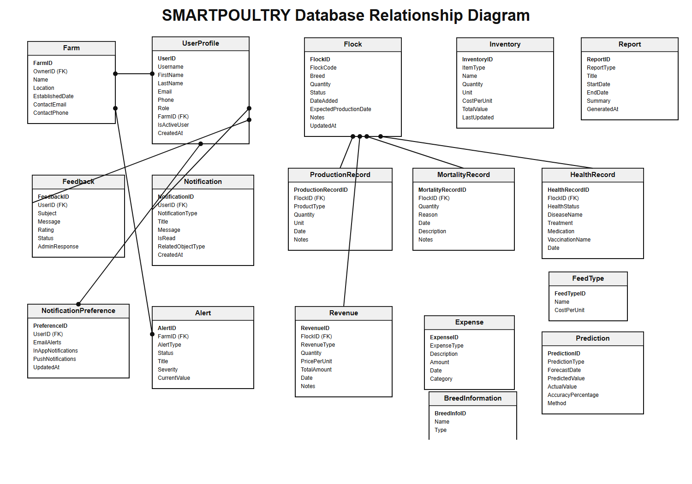
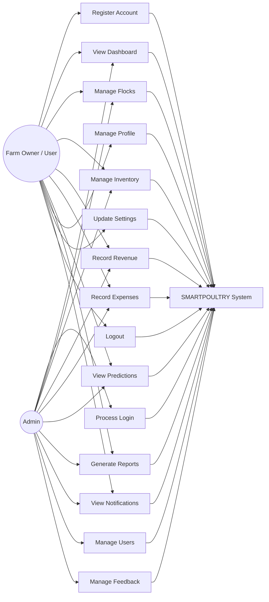

# SMARTPOULTRY Website Flowchart

## Main User Flow

1. A visitor opens the website.
2. If they are not logged in, they go to the login page.
3. New users can register, then continue to the dashboard.
4. Logged-in users use the dashboard and top navigation.
5. The Management menu opens farm operation pages.
6. The Analytics menu opens prediction and report pages.
7. The User menu opens profile, settings, notifications, and logout.

## Main Pages

| Page | URL | Purpose |
| --- | --- | --- |
| Login | `/login/` | Sign in with account credentials |
| Register | `/register/` | Create a new account |
| Dashboard | `/dashboard/` | Overview of farm metrics and charts |
| Flocks | `/flocks/` | Manage poultry flocks |
| Inventory | `/inventory/` | Track feed, medicine, and supplies |
| Revenue | `/revenue/` | Track income |
| Expenses | `/expenses/` | Track costs |
| Predictions | `/analytics/` | View analytics and predictions |
| Reports | `/reports/` | Generate and view reports |
| Manage Profile | `/profile/` | Update user profile information |
| Settings | `/settings/` | Update password and notification preferences |
| Logout | `/logout/` | End the current session |

## Use Case Diagram

## Entity Relationship Diagram

## Use Case Summary

| Use Case | Actor | Description |
| --- | --- | --- |
| Register Account | Farm Owner / User | Creates a new SMARTPOULTRY account. |
| Login | Farm Owner / User | Signs in using valid account credentials. |
| View Dashboard | Farm Owner / User | Reviews farm metrics, summaries, and charts. |
| Manage Flocks | Farm Owner / User | Adds, updates, views, or manages poultry flock records. |
| Manage Inventory | Farm Owner / User | Tracks feed, medicine, and farm supplies. |
| Record Revenue | Farm Owner / User | Adds and reviews farm income records. |
| Record Expenses | Farm Owner / User | Adds and reviews farm cost records. |
| View Predictions | Farm Owner / User | Views analytics and prediction results. |
| Generate Reports | Farm Owner / User | Creates and views farm reports. |
| Manage Profile | Farm Owner / User | Updates name, username, email, and phone number. |
| Update Settings | Farm Owner / User | Changes password and notification preferences. |
| View Notifications | Farm Owner / User | Reviews system and farm-related notifications. |
| Logout | Farm Owner / User | Ends the current authenticated session. |
| Process Login | Admin | Signs in to access administrative functions. |
| Manage Users | Admin | Views and manages registered user accounts. |
| Manage Feedback | Admin | Reviews and manages submitted user feedback. |

## Detailed Use Case: Manage Farm Operations

| Field | Details |
| --- | --- |
| Use Case Name | Manage Farm Operations |
| Primary Actor | Farm Owner / User |
| Goal | To manage daily poultry farm records from one website. |
| Preconditions | The user has an account and is logged in. |
| Trigger | The user selects an option from the Management menu. |
| Main Flow | 1. The user opens the dashboard.   2. The user selects Flocks, Inventory, Revenue, or Expenses.   3. The system displays the selected management page.   4. The user adds, views, updates, or reviews records.   5. The system saves the changes and updates the displayed data. |
| Alternative Flow | If the user is not logged in, the system redirects the user to the login page. |
| Postconditions | Farm operation records are stored and available for dashboard metrics, analytics, and reports. |
