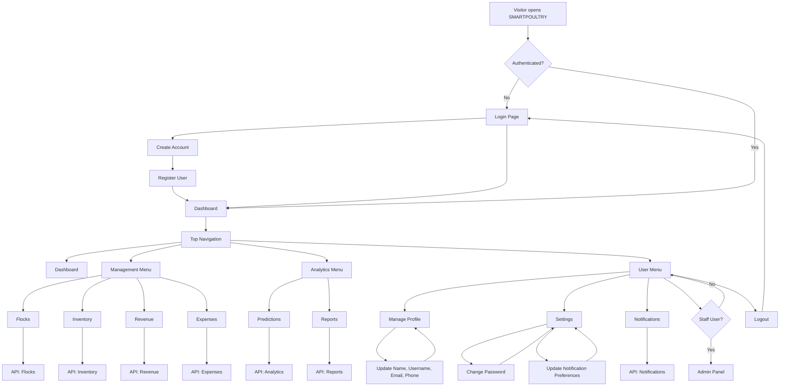

# SMARTPOULTRY Website Flowchart

## Main User Flow

1. A visitor opens the website.
2. If they are not logged in, they go to the login page.
3. New users can register, then continue to the dashboard.
4. Logged-in users use the dashboard and top navigation.
5. The Management menu opens farm operation pages.
6. The Analytics menu opens prediction and report pages.
7. The User menu opens profile, settings, notifications, admin tools, and logout.

## Main Pages

| Page | URL | Purpose |
| --- | --- | --- |
| Login | `/login/` | Sign in with account credentials |
| Register | `/register/` | Create a new account |
| Dashboard | `/dashboard/` | Overview of farm metrics and charts |
| Flocks | `/flocks/` | Manage poultry flocks |
| Inventory | `/inventory/` | Track feed, medicine, and supplies |
| Revenue | `/revenue/` | Track income |
| Expenses | `/expenses/` | Track costs |
| Predictions | `/analytics/` | View analytics and predictions |
| Reports | `/reports/` | Generate and view reports |
| Manage Profile | `/profile/` | Update user profile information |
| Settings | `/settings/` | Update password and notification preferences |
| Admin Panel | `/admin/` | Staff-only Django admin |
| Logout | `/logout/` | End the current session |

